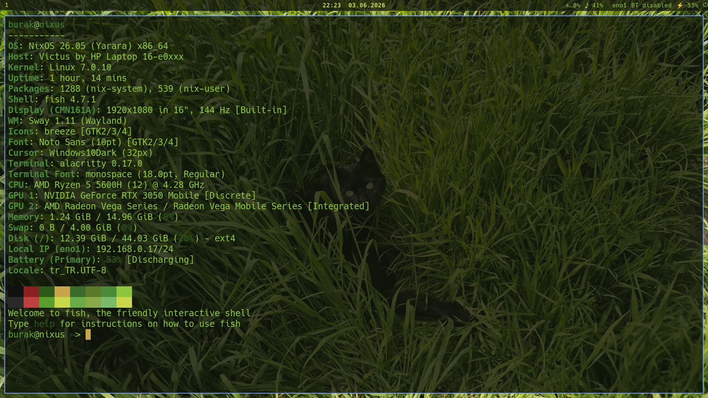
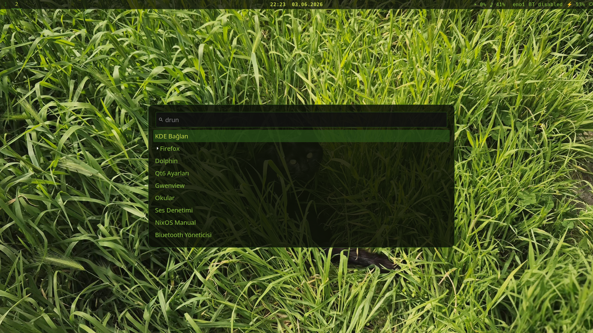

# yesnt69-nixos-dotfiles

🇹🇷 TR:
NixOS 26.05 üzerinde Sway WM kurulumu. Duvar kağıdından ilham alan yeşil/koyu temalı

🇬🇧 ENG:
Sway WM installation on NixOS 26.05. Green/dark theme inspired by the wallpaper.

Referans Görüntüler / Referance Images

<p align="center">
  
</p>

<br>
<hr>
<br>

<p align="center">
  
</p>


  


## Bileşenler / Components

| Kategori / Category | Araç / Tool |
|----------|------|
| İşletim Sistemi / Operating System | NixOS 26.05 |
| Pencere Yöneticisi / Window Manager | Sway |
| Durum Çubuğu / Status Bar | Waybar |
| Terminal | Alacritty |
| Uygulama Başlatıcı / Application Launcher | Wofi |
| Giriş Yöneticisi / Display Manager | SDDM + sddm-astronaut-theme |
| Kilit Ekranı / Screen Locker | GtkLock |
| Bildirim / Notification Daemon | Dunst |
| Kabuk / Shell | Fish |
| Ses / Audio | Pipewire + Wireplumber |


## Gerekenler / Requirements

🇹🇷 **Kuruluma başlamadan önce aşağıdakilere sahip olduğunuzdan emin olun:**
* **NixOS Minimal ISO:** Bilgisayarınızı başlatmak için güncel bir NixOS kurulum medyası (USB).
* **İnternet Bağlantısı:** Kurulum esnasında paketlerin indirilebilmesi için aktif bir bağlantı (Kablolu veya Wi-Fi).
* **Depolama:** Bu rehber varsayılan olarak bir **NVMe SSD** (`/dev/nvme0n1`) baz alınarak hazırlanmıştır. Eğer SATA SSD veya HDD kullanıyorsanız disk yollarını (`/dev/sdX` gibi) kendinize göre düzenlemelisiniz.

🇬🇧 **Before starting the installation, make sure you have the following:**
* **NixOS Minimal ISO:** A bootable NixOS installation media (USB).
* **Internet Connection:** An active connection (Ethernet or Wi-Fi) to download packages during setup.
* **Storage:** This guide is written based on an **NVMe SSD** (`/dev/nvme0n1`) by default. If you are using a SATA SSD or HDD, you must adjust the disk paths (e.g., `/dev/sdX`) accordingly.

---


## Kurulum

### 1. Disk Hazırlığı (NVMe SSD için) / Disk Preparation (for NVMe SSD)
1.1 Sisteminizin disk yapısını görmek için önce bu komutu kullanın. / To view your system's disk structure, first use this command.

```bash
lsblk
```

1.2 Kurulumu yapmak istediğiniz diski "cfdisk" ile bölümlendirin (benim için bu nvme0n1). / Partition the disk where you want to install it using "cfdisk" (for me this is nvme0n1).

⚠️ **UYARI:** "cfdisk" terminal üzerinde grafik arayüzü olan bir programdır. Diski bölümlendirme konusunda şüpheniz varsa lütfen işlem yapmak istediğiniz diski tekrar kontrol etmekten çekinmeyin.

⚠️ **WARNING:** "cfdisk" is a program with a graphical interface in the terminal. If you have any doubts about partitioning the disk, please feel free to double-check the disk you intend to work with.

```bash
mkfs.ext4 /dev/nvme0n1pA 
mkfs.fat -F 32 /dev/nvme0n1pB
mkswap /dev/nvme0n1pC
```

```bash
mount /dev/nvme0n1pA /mnt
mkdir -p /mnt/boot
mount /dev/nvme0n1pB /mnt/boot
swapon /dev/nvme0n1pC
```

⚠️ **UYARI:**  Bölüm harflerini (A,B ve C) diskinize ait gerçek bölüm numaraları ile değiştirmeyi unutmayın!

⚠️ **WARNING:** Do not forget to replace the partition letters (A, B, and C) with your actual partition numbers! 


1.2 Donanım şablonunu ilerleyen adımlar için zorunludur / Hardware config is required for following steps
```bash
nixos-generate-config --root /mnt
```


### 2. NixOS Kurulumu
2.1 Temel kurulum için, bu repoyu geçici olarak indirip configuration.nix dosyasını kopyalayın / For basic setup, temporarily download this repository and copy the configuration.nix file.

```bash
git clone https://github.com/yesnt6969/yesnt69-nixos-dotfiles
cp yesnt69-nixos-dotfiles/dotfiles/nixos/configuration.nix /mnt/etc/nixos/
```


2.2 Konfigürasyon içersindeki "burak" yazan yere kendi kullanıcı adını yaz / Replace "burak" with your username in configuration file 

```bash
nano /mnt/etc/nixos/configuration.nix
```


2.3 Bundan sonraki işlemler Nixos wiki ile aynı / The following steps are the same as with the Nixos wiki.

```bash
nixos-install
```

```bash
reboot
```

⚠️ **UYARI:** Bu komut sadece Nixos kurulumu için gerekli paketlerin kurulumunu yapar. Kurulum sonrası ince ayarlar için, kendi ayarlarınızı getirin yada sıradaki adımları uygulayın.

⚠️ **WARNING:** This command only installs the packages necessary for Nixos installation. For post-installation fine-tuning, bring your own settings or follow the next steps.


### 3. Kurulum sonrası adımları / Post-installation steps

Not: Temiz kurulum önerilir. Daha önceden bulunan kurulumunuzdaki bağımlılık(lar) sorun çıkarabilir

Note: A clean installation is recommended. Existing dependencies in your organization may cause problems.

```bash
git clone https://github.com/yesnt6969/yesnt69-nixos-dotfiles
cd yesnt69-nixos-dotfiles

```

  3.1 Konfigürasyon dosyaları için dizin oluştur / Create a directory for configuration files.

```bash
mkdir -p ~/.config/{sway,waybar,alacritty,wofi,gtklock,swaylock}
```


  3.2 Kullanıcı konfigürasyon dosyalarını kopyala / Copy user configuration files

```bash
cp dotfiles/sway/config ~/.config/sway/
cp dotfiles/waybar/config ~/.config/waybar/
cp dotfiles/waybar/style.css ~/.config/waybar/
cp dotfiles/alacritty/alacritty.toml ~/.config/alacritty/
cp dotfiles/wofi/style.css ~/.config/wofi/
cp dotfiles/gtklock/config.ini ~/.config/gtklock/
cp dotfiles/swaylock/config ~/.config/swaylock/
```


### 4. SDDM Tema Kurulumu

Kendi duvar kağıdını ~/kedi.jpg (çünkü kedileri severim) olarak kaydet, sonra / Save your wallpaper as ~/kedi.jpg (because I love cats), then:

```bash
sudo mkdir -p /var/lib/sddm-custom/sddm-astronaut-theme
sudo cp -r /run/current-system/sw/share/sddm/themes/sddm-astronaut-theme/. \
  /var/lib/sddm-custom/sddm-astronaut-theme/
sudo cp ~/kedi.jpg /var/lib/sddm-custom/sddm-astronaut-theme/Backgrounds/kedi.jpg
sudo sed -i \
  's|Background="Backgrounds/astronaut.png"|Background="Backgrounds/kedi.jpg"|' \
  /var/lib/sddm-custom/sddm-astronaut-theme/Themes/astronaut.conf
sudo chmod -R 755 /var/lib/sddm-custom
```


### 5. KDE Connect

KDE Connect kurulumda etkin geliyor / KDE Connect comes already activated

## Notlar

- `configuration.nix` içindeki `burak` kullanıcı adını ve `nixus` hostname'ini kendi bilgilerinle değiştir

- SDDM arka planı her `nixos-rebuild switch` sonrası sıfırlanır, 4. adımı tekrar çalıştırmak gerekir

- Waybar scroll ile parlaklık, tıklayarak ses kontrolü yapılabilir

- GtkLock PAM entegrasyonu `configuration.nix` içinde mevcut

- Güncel .nix konfigürasyonu yedek masaüstü ortamı olarak KDE ile gelmektedir

## Notes 

- Replace the username burak and the hostname nixus in configuration.nix with your own details.

- The SDDM background resets after every nixos-rebuild switch; you will need to rerun step 4.

- Waybar allows brightness control via scrolling and audio control via clicking.

- GtkLock PAM integration is available within configuration.nix.

- Current .nix configuration comes with KDE for backup.
